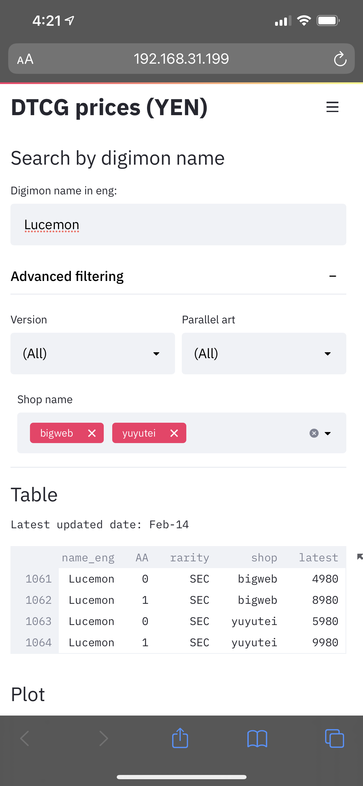
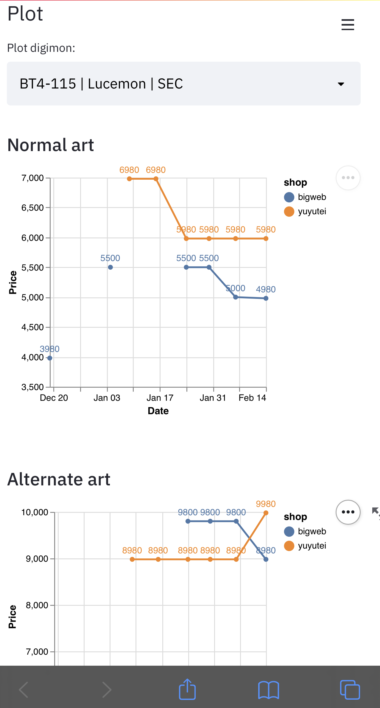

# Digimon TCG price tracking webapp

A simple price tracker for digimon TCG card price list. Prices are based on Japanese shops, currently looking at:
- bigweb
- yuyutei

## Search by name ##
You search enter full/partial names of the digimon (eg. greymon will return greymon, wargreymon, metalgreymon etc.)

You will see a table with the latest price of all the matching digimons.

## Price trend analysis ##
You can then also pick one of them from the dropdown menu, and see the trend of the price by scrolling down and select your interested digimons.

> Prices will be updated weekly.

## Tools ##
Built using Streamlit
